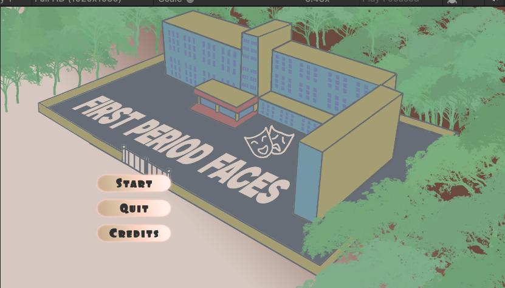
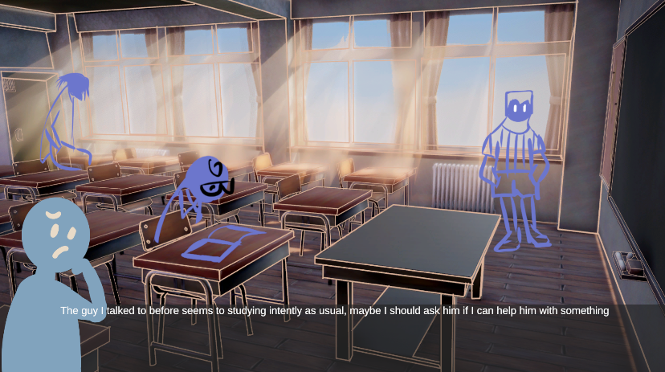
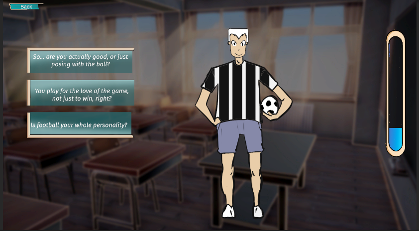
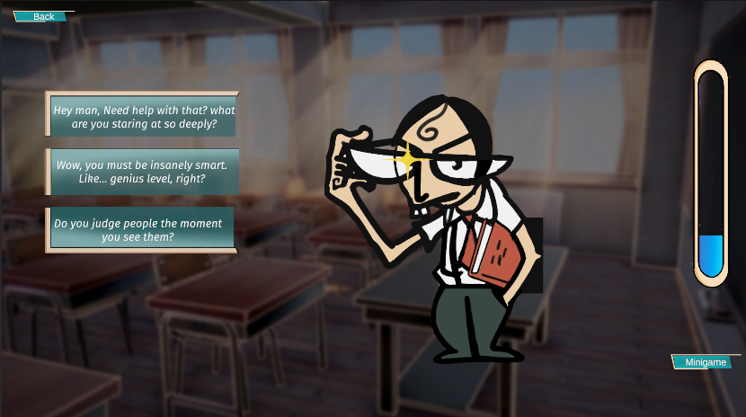
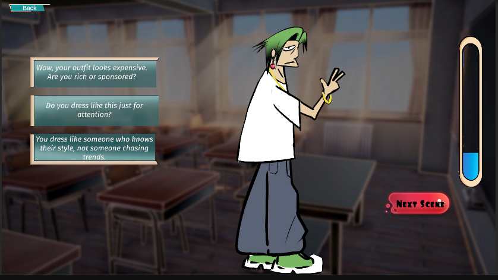

# 🎭 First Period Faces

> *A social simulation game about navigating friendships on your very first day of school.*

Built for **Global Game Jam** — a 48-hour game jam experience.

---

## 📸 Screenshots

### Main Menu


### Classroom Exploration


### Dialogue System


### Character Interaction — The Footballer


### Character Interaction — The Nerd


### Character Interaction — The Fashionista


---

## 🎮 About the Game

**First Period Faces** is a 2D social simulation / visual novel game set in a school classroom. You play as a new student stepping into class for the first time — the goal is simple: **make friends before the bell rings.**

Each classmate has a unique personality. Your words matter. Choose your dialogue options wisely to build friendship levels with each character. Say the wrong thing, and the meter drops. Say the right thing, and you just might earn a true friend.

---

## ✨ Features

- 🏫 **Immersive Classroom Environment** — 3D-rendered school backdrop with hand-drawn 2D character art
- 💬 **Branching Dialogue System** — 3 dialogue choices per interaction, each affecting the friendship meter differently
- 📊 **Friendship Meter** — A real-time vertical bar tracks your relationship progress with each character
- 🎮 **4 Integrated Minigames** — Instead of just talking, some characters challenge you to minigames:
  - QTE Fashion Challenge
  - Paper Throwing Game
  - Sprint Star
  - Paper Game
- 🧠 **Hint System** — Subtle in-world hints help you figure out what each character values
- 🎭 **Unique Character Archetypes:**
  - ⚽ The Footballer — competitive, confident
  - 🤓 The Nerd — intense, perceptive
  - 👗 The Fashionista — stylish, self-assured
  - + more characters to discover
- 🎵 **Sound Manager** — Background audio and interaction sounds for immersion
- 🎬 **Cutscene System** — Story-driven intro and transition scenes

---

## 🛠️ Tech Stack

| Tool | Usage |
|------|-------|
| **Unity 6** (6000.2.14f1) | Game Engine |
| **C#** | Game scripting |
| **Universal Render Pipeline (URP)** | Rendering & visuals |
| **TextMesh Pro** | UI text rendering |
| **Unity Input System** | Player input handling |
| **2D Animation** | Character animations |

---

## 📁 Project Structure

```
Assets/
├── Animation/          # Character & UI animations
├── Audio/              # BGM and SFX
├── Images/             # UI images and backgrounds
├── Materials/          # URP materials
├── Prefab/             # Reusable game objects
├── Scenes/             # StartScene, Classroom, etc.
├── Scripts/            # All C# game logic
├── Settings/           # URP & project settings
├── Pixel Font - Tripfive/  # Custom pixel font
└── TextMesh Pro/       # TMP assets
```

---

## 📜 Core Scripts

| Script | Purpose |
|--------|---------|
| `DialogueManager.cs` | Controls dialogue flow and branching |
| `SingleChoice.cs` | Handles individual dialogue option selection |
| `FriendlinessManager.cs` | Tracks and updates friendship meters |
| `InteractionManager.cs` | Manages player-NPC interaction triggers |
| `MiniGameManager.cs` | Loads and controls minigame sessions |
| `QTEFashionManager.cs` | Quick-Time Event minigame logic |
| `SprintStart.cs` | Sprint minigame logic |
| `PaperGame.cs` / `PaperThrow.cs` | Paper throwing minigame |
| `CutsceneManager.cs` | Handles story cutscenes |
| `SceneLoader.cs` | Async scene transitions |
| `MainMenuManager.cs` | Start, Quit, Credits menu logic |
| `UICharacterManager.cs` | Character UI display and animation |
| `DataStream.cs` | Persistent game data handling |
| `DontDestroy.cs` | Keeps objects alive across scenes |
| `TutorialController.cs` | First-time tutorial flow |

---

## 🚀 How to Run

1. Clone the repository:
```bash
git clone https://github.com/Apoorv-34/Friend-Forever-Game-.git
```
2. Open in **Unity 6** (version 6000.2.14f1 or later)
3. Open the `StartScene` from `Assets/Scenes/`
4. Press ▶ Play

---

## 👥 Credits

- **Apoorv Goyal** — Developer, Scripting
- Built at **Global Game Jam — Indore**
- Unity 6 · URP · C#

-  **Aditya Ahuja** — Developer, Scripting
- Built at **Global Game Jam — Indore**
- Unity 6 · URP · C#

---

## 📄 License

This project was created for Global Game Jam and is shared for educational and portfolio purposes.
